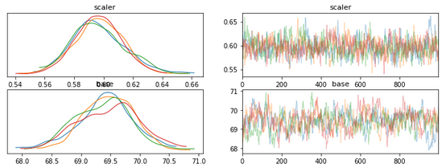
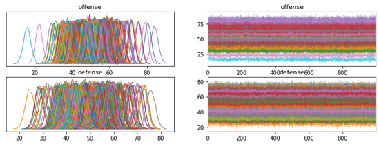

## NCAA Basketball Ratings using pymc3

This repo implements a simple offensive/defensive rating system to be used with the Kaggle NCAA Basketball competitions. The rankings
come from only the regular season games, matching what is provided by Kaggle yearly. This is to make them more useful for predicting
tournament games without information leakage.

The approximate function we're estimating looks like this:

```python 
s = offense[t1_idx] - defense[t2_idx]) * scaler + base
score = Normal(mu=s, sigma=constant)
```

There are a number of other formulations that we could explore, but this approach produces a strong but not 1:1 rank-correlation
 with the kenpom.com features for 2022 and with Elo ratings (with and without factoring in score).

The Elo features are calculated in a manner similar to FiveThirtyEight's NCAA basketball Elo, though without factoring Home/Away, 
and experimenting with many values of K. There are Elo scores computed factoring in score and soley on win/loss.

```
kendalltau(offensive_ratings, kenpom.adj_o) --> KendalltauResult(correlation=0.7286139425416902, pvalue=1.651697584060781e-93)
kendalltau(defensive_ratings, kenpom.adj_d): KendalltauResult(correlation=-0.7328130783894062, pvalue=1.7001932771500618e-94)
kendalltau(offensive_ratings+defensive_ratings, kenpom.rank): KendalltauResult(correlation=-0.9248418468510999, pvalue=5.588765768618526e-150)
kendalltau(offensive_ratings+defensive_ratings, elo_features): KendalltauResult(correlation=0.7084946338085796, pvalue=7.910211457815486e-89)
```




Above is an estimate for the base score and scaling factor. That means that the most likely score estimate is about `(T1Off - T2Def)*0.59 + 69.5`



Above is a plot of the estimated offense and defense ratings for every team.


### Scaling

Some of the features of the modeling pipeline are memory-inefficient, so modeling all of the years at once tends to be impractical. To keep the 
scores similar, though, we model a running set of 3 years and keep only the last one. So the 2012 ratings come from modeling 2010, 2011, and 2012,
then discarding the first two years.

To speed things up, several variables were estimated using a slow, expensive run, then set to a static value (`scaler`, `base`, and some of the `sigma` values). This
doesn't seem to influence the ratings much, but speeds convergence.